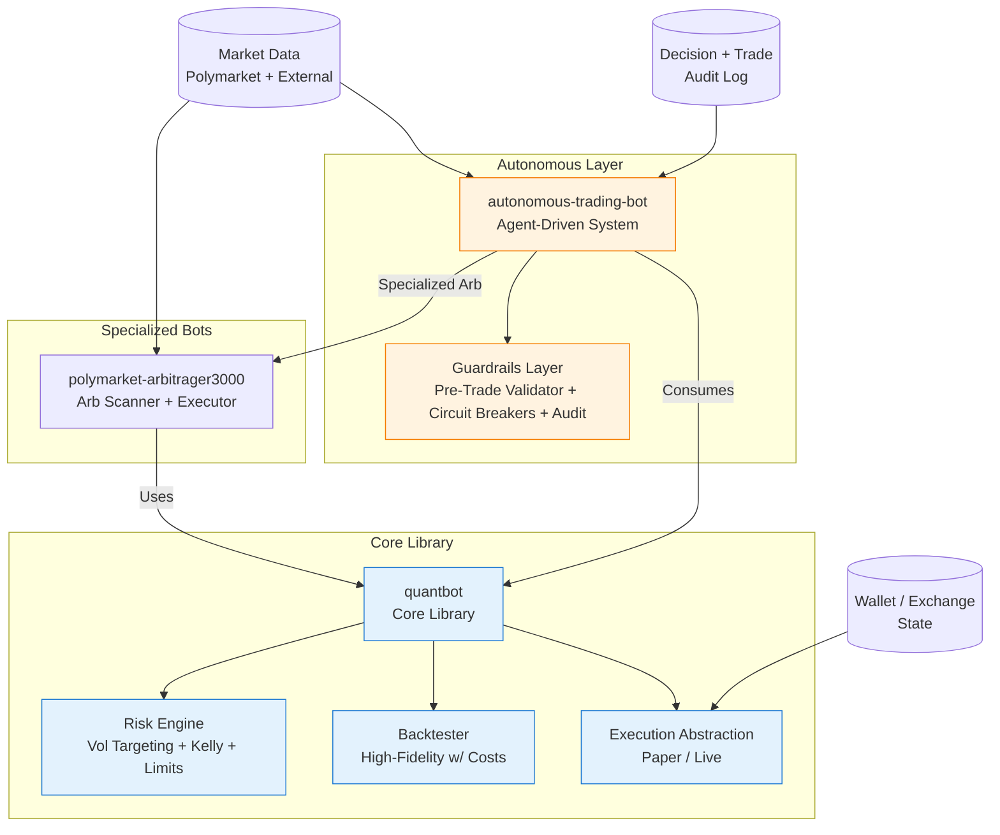
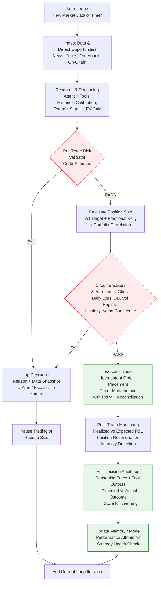
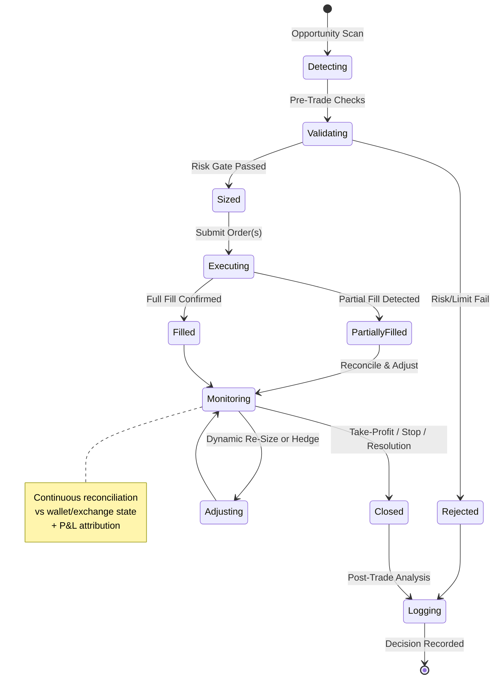
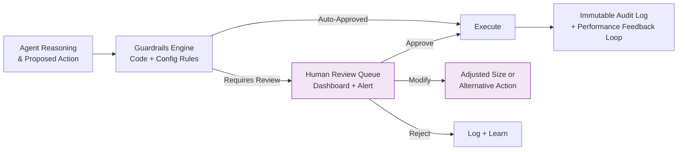

# Considerations for `quantbot`, `polymarket-arbitrager3000`, and `autonomous-trading-bot`

**Status**: Draft Spec v0.2 (with Diagrams) | **Date**: 2026-05-22 | **Owner**: Grok (for review by @derekclair and Grok Build)

> **Purpose**: This living document captures critical considerations, risks, architectural principles, and open questions for resuming or advancing work on quantitative trading systems, with special emphasis on the autonomous-trading-bot. It is written so that Grok Build, AI agents, or human developers can pick it up and execute methodically using spec-driven development (SDD). 
>
> These projects carry significant financial, operational, regulatory, and personal risk. They should only proceed with strict scoping, robust safeguards, and alignment to broader life priorities (SRE career, family towel manufacturing business, family time).

---

## Architecture & Trading Logic Diagrams

> **Note**: All diagrams use Mermaid syntax (natively rendered by GitHub). They focus on **trading logic and flows**, not low-level function calls. They are designed to be implementation-agnostic so they can guide both traditional quant code and agentic implementations.

### 1. High-Level System Overview



**Key Insight**: `quantbot` provides the trustworthy foundation. The autonomous layer adds intelligence + strict guardrails. Everything funnels through the Risk Engine and Guardrails.

### 2. Autonomous Trading Logic Flow (Core Execution Logic)

This is the primary trading logic diagram for the `autonomous-trading-bot`. It shows the end-to-end decision and execution flow with safety baked in at every critical gate.



**Trading Logic Highlights**:
- **Every opportunity passes through a hard-coded Pre-Trade Risk Validator** (not just a prompt).
- **Circuit breakers** are independent of the reasoning agent.
- **Full audit trail** is mandatory before and after every action.
- Failure paths always lead to logging + human escalation rather than silent continuation.
- The loop supports both high-frequency scanning and event-driven triggers.

### 3. Risk & Position Sizing Logic (Detailed Gate)

Zoomed-in view of the critical sizing and risk gate used by all three projects.

```mermaid
flowchart TD
    Opp[Opportunity /
Signal Detected] --> Data[Fetch Current Portfolio
State + Market Vol + Correlations]
    
    Data --> VolTarget[Apply Volatility Targeting
Position Scalar =
Target Vol / Realized Vol
EWMA or ATR]
    
    VolTarget --> Kelly[Apply Fractional Kelly
f = (b·p - q) / b
Edge-Adjusted for Fees & Resolution Risk]
    
    Kelly --> Corr[Adjust for Portfolio
Correlation & Heat
Reduce if Theme Concentration High]
    
    Corr --> Limits{Hard Limits Check
• Per-Position Cap
• Daily Loss Limit
• Trailing DD Stop
• Liquidity Threshold}
    
    Limits -->|Pass| Approve[Approve Sized Position
+ Generate Trade Plan]
    Limits -->|Fail| Reject[Reject + Log Rationale
+ Suggest Alternative or Hold]
    
    classDef decision fill:#fff8e1,stroke:#f9a825
    class Limits decision
```

**Formulas embedded**:
- Volatility targeting scalar
- Fractional Kelly for discrete prediction market outcomes
- Correlation/heat overlay

### 4. Trade Execution & Monitoring State Flow

High-level state machine for a single trade lifecycle (used by both arb and directional strategies).



**Key States**:
- Emphasis on reconciliation and dynamic adjustment (important for autonomous systems).
- Rejected and Logging states ensure nothing is silent.

### 5. Guardrails & Human Oversight Integration

How the autonomous system interacts with human oversight.



---

## 1. Project Definitions & Scope

### quantbot (Foundation Layer)
Core reusable library and framework for quantitative trading:
- Backtesting engine (event-driven or vectorized, with realistic market microstructure simulation)
- Signal generation & feature engineering abstractions
- Portfolio construction, optimization, and rebalancing logic
- Risk engines (position sizing, VaR, drawdown controls, correlation)
- Execution abstractions (paper, live via exchange APIs/wallets)
- Performance analytics & attribution

**Tech lean**: Python (pandas, numpy, scipy, scikit-learn or PyTorch for models, SQLAlchemy + Postgres for state, Alembic migrations). Modular, testable, production-grade from day one.

### polymarket-arbitrager3000 (Specialized Arb Bot)
Focused on detecting and capturing arbitrage or relative value opportunities involving Polymarket contracts:
- Cross-platform arb (Polymarket vs. PredictIt, Kalshi, other PMs, or implied probabilities from sportsbooks/news aggregates)
- On-chain / orderbook inefficiencies
- Event-specific or cross-event relative value
- Latency-sensitive execution with smart routing and partial-fill handling

Emphasizes capital efficiency, fee modeling, and rapid opportunity decay.

### autonomous-trading-bot (Primary Focus - "Especially")
End-to-end autonomous (or semi-autonomous) agent-driven trading system. Capable of:
- Market research & idea generation (news, polls, on-chain, social, historical calibration)
- Strategy selection / parameter tuning
- Risk-aware position sizing & portfolio allocation across multiple opportunities
- Trade execution, monitoring, adjustment, and exit
- Self-reporting, anomaly detection, and escalation

**Key Differentiator**: Strong emphasis on **safety, auditability, and human oversight layers** even while pursuing high autonomy. Built on agent frameworks (e.g., extensions of OpenClaw/Hermes patterns, LangGraph-style, or MCP/tool-use with Grok/Hermes models) with heavy investment in guardrails.

**Non-Goals (initially)**: High-frequency trading, leverage/margin products (unless explicitly risk-modeled), fully hands-off with large capital.

---

## 2. Core Principles (Non-Negotiable)

1. **Risk Management is Code, Not Suggestion** — Hard limits, pre-trade validators, and circuit breakers must be enforced in software, not just prompted to an LLM.
2. **Spec-Driven Development (SDD)** — Every major component or strategy begins with a clear spec, decision log, tests, and acceptance criteria before implementation.
3. **Positive Expectancy After All Costs** — Realistic backtesting (slippage, fees, latency, partial fills, resolution risk) + paper trading validation required before live capital.
4. **Capital Preservation First** — Drawdown limits, position sizing rules, and kill criteria take precedence over return chasing.
5. **Full Auditability & Replayability** — Every decision, data snapshot, tool call, and reasoning trace must be logged immutably for post-trade analysis, tax, regulatory, and debugging.
6. **Human-in-the-Loop by Default** — Even "autonomous" systems start with tight human oversight, staged capital ramps, and easy kill switches. Autonomy is earned through proven reliability.
7. **Alignment with Life Priorities** — Development velocity should leverage AI (Grok Build, Hermes, Copilot, MCP) aggressively but respect primary focuses: SRE excellence at IQGeo, premium towel business with family, and personal/family time (e.g., Kauai trip June 2026).

---

## 3. Risk Management Framework (Applies to All Three Projects)

### Position Sizing & Portfolio Construction
- **Volatility Targeting** (strongly recommended, per prior discussions):
  \[ \text{position scalar} = \frac{\text{target portfolio volatility}}{\text{realized volatility (EWMA or ATR)}} \]
  Scale notional exposure inversely to current realized vol so portfolio risk stays roughly constant. High vol regimes → de-risk automatically. Low vol → scale up (with caps).
- **Kelly / Fractional Kelly** for discrete bets (common in prediction markets):
  \[ f^* = \frac{b p - q}{b} \]
  where \( p \) = model probability of winning/resolving favorably, \( q = 1-p \), \( b \) = fractional odds (net profit per unit staked on win). Use fractional (e.g., 0.25–0.5 Kelly) for robustness.
- **Portfolio Heat & Correlation**: Track covariance between positions (political events often correlate strongly). Avoid concentrated bets on single themes (e.g., all US election contracts).
- **Hard Limits** (enforced in code):
  - Max % of bankroll per single position or event cluster
  - Max daily/weekly loss limit → auto-pause
  - Trailing drawdown stop (e.g., pause if peak-to-trough > 15–20%)
  - Overall portfolio volatility cap
- **Stress Testing & Scenario Analysis**: Simulate historical stress periods (election nights, COVID crash analogs, low-liquidity events, flash resolution disputes). Monte Carlo with fat tails.

### Execution & Operational Risk
- Slippage, partial fills, and adverse selection modeling in backtests and live.
- API/wallet failure modes, rate limits, gas spikes (for on-chain).
- Reconciliation loops: bot state vs. actual wallet/exchange positions (detect desyncs early).
- Funding & Treasury: Separate hot wallet with limited balance; periodic sweeps; clear rules for profit extraction vs. reinvestment.

---

## 4. Polymarket-Specific Considerations

- **Integration & Data**:
  - Official Polymarket API, GraphQL/subgraph, or direct Polygon on-chain queries for positions, orders, resolutions.
  - Historical data: trade prices, volumes, order books (if available), resolution outcomes + dispute history (important for calibration and risk).
  - Liquidity & depth: Many contracts are thin; model realistic fill probabilities and slippage curves calibrated to historical data.
- **Resolution & Dispute Risk**: Not all contracts resolve cleanly or instantly. Factor in dispute windows, UMA-like oracle mechanisms if used, and probability of adverse resolution even if "correct."
- **Arbitrage & Relative Value**: Look for persistent mispricings vs. other platforms (adjusted for fees, capital lockup, withdrawal friction, resolution differences). Also vs. aggregated external signals (polls, prediction markets, news-derived probs) when edge is statistically validated.
- **Event Selection**: Prioritize high-liquidity, well-understood events with good external data for model calibration. Avoid low-volume or highly subjective resolutions initially.
- **Timing Dynamics**: Strong time decay/gamma-like effects near resolution. Strategies that work days/weeks out may fail in final hours.
- **Fees & Costs**: Trading fees + gas (Polygon is cheap but still) + opportunity cost of capital locked in positions. Must be net positive after all.
- **Wallet & Security**: Hot wallet for bot with strict allowances or proxy contracts. Never store large balances long-term. Use hardware wallet or multi-sig for treasury. Monitor for smart contract risks or platform changes.
- **Regulatory Note**: Polymarket has navigated (and sometimes restricted) US users. Ensure any deployment respects current terms, geofencing if needed, and personal legal/tax advice. Prediction markets sit in a gray area between information markets, gambling, and derivatives.

---

## 5. Arbitrage Engine Considerations (`polymarket-arbitrager3000`)

- **Opportunity Detection**: Multi-source real-time pricing + historical persistence scoring. Avoid one-off noise; favor repeatable, decaying-but-predictable edges.
- **Execution Quality**: Atomicity where possible (or tight sequencing with rollback logic). Smart handling of partial fills and adverse leg moves.
- **Net Profit Modeling**: All-in costs (fees, gas, slippage, spread, capital opportunity, borrow costs if any). Many "arb" opportunities evaporate once modeled realistically.
- **Capital Recycling & Inventory**: Arb is often market-neutral in theory but becomes directional on execution risk. Size appropriately and have hedging/exit plans.
- **Competition & Decay**: Other bots/humans will close obvious arbs quickly. Focus on speed (low-latency data + execution) or on more complex/niche opportunities requiring research or multi-leg reasoning.
- **Monitoring**: Track realized vs. expected arb P&L, hit rate, average hold time, competition signals.

---

## 6. Autonomy, Agent Design & Safety (Critical for `autonomous-trading-bot`)

### Agent Architecture Recommendations
- **Loop**: Perception (market state, news, positions, performance) → Reasoning (with tools) → Planning → Action (trade, adjust, research, alert) → Observation → Learning.
- **Multi-Agent or Hierarchical**: e.g., Researcher agent (idea gen + deep dive), Risk Overseer (independent veto or sizing), Executor (order placement + monitoring), Auditor (post-trade analysis + logging).
- **Tools**: Market data fetchers, order placement/cancel/check, position & wallet query, EV/Kelly/vol-target calculator, news/web search, historical backtester hook, notification sender, human escalation tool.
- **Memory**: Short-term (current positions, recent decisions), long-term (strategy performance history, market regime memory, lessons from past trades). Use summarization or vector DB for long context.

### Safety & Guardrails (Non-Negotiable Layer)
- **Pre-Trade Risk Validator** (hard code, not prompt-only):
  - Position size within per-trade and portfolio limits?
  - Expected value / edge above minimum threshold after costs?
  - Liquidity and fill probability acceptable?
  - No violation of daily loss or drawdown circuit breakers?
  - Agent confidence or uncertainty quantification within bounds?
- **Circuit Breakers & Kill Switches**:
  - Daily/rolling loss limit → auto-pause all trading + human alert.
  - Unusual volatility regime or API error rate spike → reduce size or pause.
  - Agent decision anomaly (e.g., sudden large deviation from historical behavior) → shadow mode or human review.
  - Global kill switch (env var, file, or API endpoint) that can be triggered remotely or by monitoring script.
- **Reconciliation & Invariant Checks**: Periodic check that internal position book == actual on-chain/wallet state. Auto-pause + alert on mismatch.
- **Decision Audit Trail**: Every trade or decision stores: timestamp, full reasoning trace (CoT or structured), tool inputs/outputs, data snapshot (prices, probs, news), expected outcome, actual outcome (for later labeling).
- **Staged Rollout**: 
  1. Backtest + unit tests
  2. Paper trading with simulated realistic fills
  3. Small live capital (e.g., 1–5% of intended) with tight limits
  4. Gradual increase only after sustained positive results + review
- **Human Oversight Mechanisms**: Dashboard (P&L, positions, recent decisions, alerts), Telegram/Slack/email notifications for key events or anomalies, scheduled human review cadence (daily/weekly), easy escalation path for agent to ask human.

### LLM/Agent Specific Risks & Mitigations
- Hallucination & Tool Reliability: Ground every numeric claim or decision in tool outputs. Use structured output (JSON schema) and validation.
- Cost & Latency: Prefer smaller/faster models (or local Hermes/Grok inference on your cluster) for routine decisions; reserve frontier models for complex reasoning. Cache aggressively.
- Prompt Injection / Goal Misalignment: Strong system prompts + constitutional-style rules ("You are a conservative fiduciary risk manager. Never risk ruin for higher returns. If data is insufficient, do not trade or escalate."). Test adversarial prompts.
- Consistency & Reproducibility: Version prompts, model endpoints, and tool definitions. Log exact versions used for each decision.
- Evaluation: Offline replay of historical scenarios, online shadow mode (agent proposes but human or rule-based executes), A/B testing against baseline strategies.

---

## 7. Technical Architecture & Infrastructure

- **Core Stack**: Python 3.12+, async where beneficial (asyncio, aiohttp), SQLAlchemy + Postgres (as in silverback-market-observer pattern) for trade/position/journal state, Redis or similar for queues/cache, Alembic for migrations.
- **Backtesting**: Must be high-fidelity. Include: realistic order book simulation or historical replay, variable latency, partial fills, maker/taker fees, gas, slippage curves calibrated to Polymarket data, resolution uncertainty. Avoid survivorship or look-ahead bias.
- **Live Execution**: Idempotent order placement, retry with backoff, exactly-once semantics where possible via journaling. Support both paper and live modes with config flag.
- **Observability**: Structured logging (structlog or similar), metrics (Prometheus + Grafana or simple internal), distributed tracing if multi-service, alerting (PagerDuty, OpsGenie, or simple webhook to Telegram). SRE best practices from your day job apply directly here.
- **Deployment**: Docker (Dockerfile + compose already in silverback style), optional K8s for scale/reliability. CI/CD via GitHub Actions (tests on every PR, staged deploys). Secrets management (never commit, use env vars + Doppler or similar).
- **Security**: Principle of least privilege for wallets (limited allowances, session keys if supported), network isolation (Tailscale/VPN as you use), input sanitization, rate limiting, anomaly detection on API usage or P&L.
- **State & Replay**: Full trade journal with enough context to replay any decision or simulate "what if" scenarios. Critical for debugging, tax, and continuous improvement.

---

## 8. Data, Modeling & Edge Generation

- **Data Sources**: Polymarket historical + live (API/subgraph/on-chain), external prediction markets, poll aggregators, news APIs (with bias awareness), X/social via tools, economic calendars, on-chain whale activity if relevant.
- **Feature Engineering & Calibration**: Price history, implied probs vs. external, volume/order flow imbalance, time-to-resolution effects, historical resolution accuracy of market prices, regime indicators (election season vs. quiet periods).
- **Model Approaches**: Hybrid preferred — rule-based or statistical for well-understood edges + LLM/agent for novel or information-rich events. Online learning or periodic retraining with proper safeguards against overfitting.
- **Validation Discipline**: Time-series cross-validation (purged, embargoed), walk-forward optimization, strict out-of-sample testing, paper trading validation before live. Performance attribution by sub-strategy, market type, regime.

---

## 9. Operational, Monitoring & Runbooks

- **24/7 Nature**: Crypto/prediction markets don't sleep. Monitoring, alerting, and auto-pause must work unattended. Consider redundancy (multiple instances, failover).
- **Daily/Weekly Cadence**: Automated overnight reports (P&L, positions, alerts, top decisions), human review of exceptions, weekly deeper performance & strategy health check.
- **Incident Response**: Documented runbooks for common failures (API down, wallet desync, large unexpected loss, agent anomaly). Post-mortem even on paper trading incidents.
- **Cost Tracking**: All-in (compute, LLM tokens, data feeds, gas, opportunity cost, dev time). Regular ROI and break-even analysis.
- **Tax & Record Keeping**: Design exportable, queryable trade logs with cost basis, proceeds, rationale. Integrate with tax software or accountant workflow from the start. US crypto and event contract taxation can be complex — seek professional advice.

---

## 10. Regulatory, Legal, Tax & Ethical Considerations

- **Regulatory**: Prediction markets occupy a complex space. CFTC has jurisdiction over many event contracts; platforms have faced enforcement. Polymarket specifically has had US access changes. Any scaled operation may trigger registration, KYC/AML, or other requirements. **Strongly recommend consulting securities/fintech counsel before committing significant capital or marketing externally.**
- **Tax (US Persons)**: Resolutions and trades are generally taxable events (capital gains/losses). Short-term vs. long-term depends on hold period. USDC and Polygon gas have their own tracking. Meticulous records are essential; consider entity structure (e.g., single-member LLC) for liability protection and tax flexibility. Wash-sale rules may or may not apply — confirm with CPA.
- **Legal Structure & Liability**: Personal trading vs. business entity. Liability for bugs causing losses (to self or theoretically others if productized). Terms of Service compliance for all platforms used.
- **Ethical**: Prediction markets can improve collective intelligence but also enable speculation that feels like gambling. Autonomous systems should not manipulate markets or exploit information asymmetries unfairly. Be transparent if discussing publicly. Avoid strategies that could distort real-world event incentives (e.g., political outcomes). Responsible approach: treat as sophisticated information arbitrage, not exploitation.
- **Personal Risk**: Never deploy capital you cannot afford to lose entirely. Autonomous systems can fail spectacularly and quickly due to bugs, regime shifts, or black swans. Start tiny, prove the system, then scale deliberately.

---

## 11. Development Process, Tooling & AI Leverage

- **Spec-Driven**: This document is the starting spec. Break into focused sub-specs (e.g., `RiskEngine.spec.md`, `PolymarketDataAdapter.spec.md`, `AgentGuardrails.spec.md`, `Backtester Fidelity Requirements.md`). Use DECISIONS.md for key architectural choices and their rationale.
- **Testing Strategy**: Unit tests for math/risk logic, integration tests with mocked APIs, high-fidelity backtests, paper trading simulations with realistic noise, small live pilots with strict limits.
- **AI Augmentation**: Use Grok Build, Hermes agents, Copilot (with your copilot-instructions.md patterns), MCP servers, and sequential thinking for high-velocity planning, code generation, research, and documentation. However, **critical safety, risk, and financial logic must be human-reviewed line-by-line** initially.
- **Version Control & Context**: Keep this spec, decision logs, prompt versions, and model configs in the repo. Use persistent memory files (GROK.md / MEMORY.md style) for long-running agent context.
- **Roadmap Sketch (Phased, Prioritized)**:
  1. **Foundation (quantbot core)**: Data pipelines for Polymarket historical + live, high-fidelity backtester, basic risk engine (vol targeting + Kelly), simple signal + execution framework.
  2. **Arb MVP**: polymarket-arbitrager3000 scanner + executor for 1–2 high-confidence arb types (e.g., vs. another liquid PM platform), with full fee/slippage modeling and paper trading validation.
  3. **Autonomous Skeleton**: autonomous-trading-bot basic loop (perception → tools → reasoning → guarded action), paper trading mode, core guardrails (pre-trade checks, circuit breakers, audit logging), human notification layer.
  4. **Integration & Hardening**: Full portfolio risk across bots/strategies, advanced monitoring/dashboard, tax export, staged live capital ramp (start <5% intended allocation).
  5. **Iteration & Scaling**: Performance attribution, strategy promotion/kill criteria, agent self-improvement loops, optional multi-agent specialization.

---

## 12. Open Questions & Decisions to Resolve Before Major Work

- Which market categories to prioritize first (US politics/elections, crypto events, sports, economics, international)? Liquidity, data availability, and personal edge/knowledge should drive this.
- Target risk/return profile (e.g., target Sharpe >1.5? Max acceptable DD 10–15%? Target annualized vol?)?
- Capital allocation model across the three bots + any discretionary/human strategies. Rebalancing rules?
- Degree of autonomy vs. human oversight: fully agent-driven for small size, or always human sign-off for trades above threshold?
- Tech choices for agent runtime: heavy LLM (Grok/Hermes API or local), hybrid rules+LLM, or mostly traditional quant with light agent orchestration?
- Local inference priority (your DGX Spark / M1 Max cluster) vs. API for cost, latency, privacy, and reliability?
- Integration points with existing infrastructure (Tailscale, local AI hardware, SRE monitoring patterns, towel business ops tooling)?
- Exit/monetization options if successful: personal compounding, prop capital, open-source core, or productize as trading infrastructure/tooling for others?
- Time & focus guardrails: Given towel business priority and family commitments (including June 2026 Kauai trip), what is the sustainable weekly hour budget and how to use AI to maximize leverage without distraction?
- Regulatory/tax setup: When to involve counsel/CPA? Entity structure? Record-keeping standards from day one?

---

## 13. References & Prior Context

- Prior discussions on volatility targeting position sizing for Polymarket (target vol / realized vol formula and its Sharpe improvement evidence from equities literature, with caveats for event-driven markets).
- Kelly Criterion and EV-based betting frameworks.
- Prediction market efficiency, arbitrage studies, and resolution risk literature.
- Agent safety, scalable oversight, and tool-use reliability research (Anthropic, OpenAI, academic papers on LLM agents in high-stakes domains).
- Your professional SRE experience: apply the same rigor to observability, graceful degradation, on-call patterns, and production reliability for trading infrastructure.
- Memory context: These projects are historically interesting but currently deprioritized relative to the family premium towel manufacturing venture and primary SRE role. Any resumption should be deliberate, well-scoped, and AI-accelerated.

---

## 14. Recommended Immediate Next Steps

1. **Review & Iterate on this Spec**: User + Grok Build feedback. Refine definitions, priorities, and open questions. Convert open questions into DECISIONS.md entries as resolved.
2. **Repo Setup**: Consider a dedicated repo (e.g., `quant-trading` or `polymarket-trading`) or a `trading/` subdirectory in ai-workspace or silverback-market-observer for shared patterns (Docker, DB, Alembic). Add this spec, initial DECISIONS.md, and high-level architecture diagram (text or Mermaid).
3. **Prioritize Safety Infrastructure**: Build or adapt the risk engine, pre-trade validator, circuit breakers, and audit logger *before* any strategy logic or agent loop that can place orders.
4. **Data Foundation**: Stand up reliable Polymarket historical data ingestion + backtester with realistic costs. Validate against known historical edges or published PM studies.
5. **Small Scoped Pilot**: Choose one narrow, high-conviction opportunity (e.g., a specific arb type or simple event contract strategy) and take it through the full pipeline: spec → backtest → paper → tiny live with full guardrails.
6. **Leverage AI Ruthlessly but Safely**: Use Grok Build / Hermes / Copilot / MCP for research, code scaffolding, test generation, and documentation — but treat risk/safety/financial logic with extra scrutiny and human review.

---

**This is a living document (v0.2).** Update it as decisions are made, backtests reveal realities, live trading teaches lessons, and life priorities evolve. The goal is not to build the fastest or most autonomous bot, but to build one that is *safe, auditable, and aligned* — one that can compound capital responsibly while fitting into a balanced, family-oriented, and professionally demanding life.

*Generated with care by Grok for @derekclair — diagrams added per request. Ready for pickup by Grok Build and iterative execution.*
