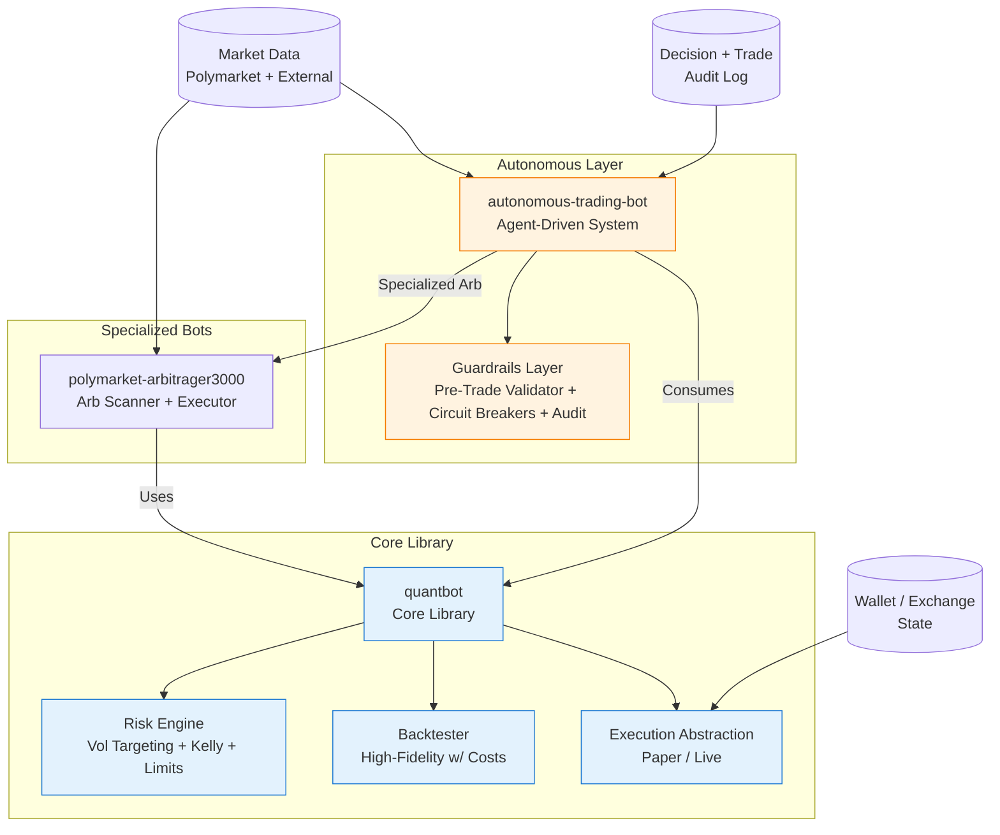
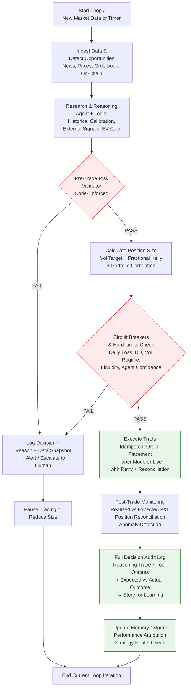
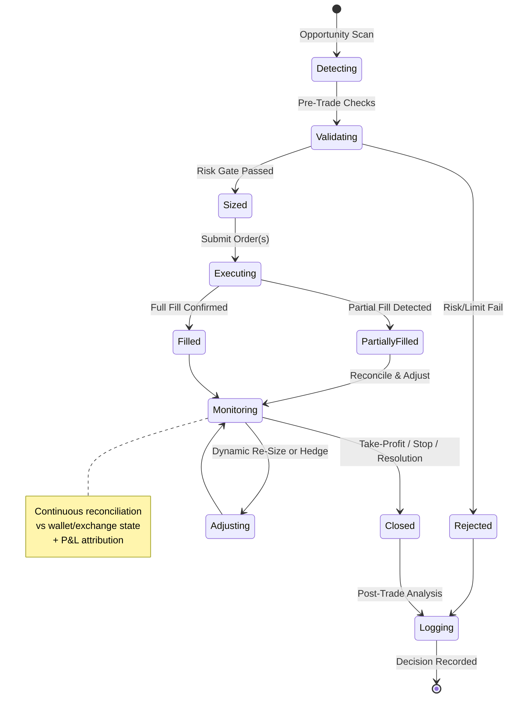
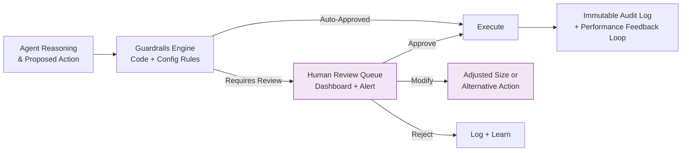

# Considerations for `quantbot`, `polymarket-arbitrager3000`, and `autonomous-trading-bot`

**Status**: Draft Spec v0.3 (Diagrams fixed + expanded) | **Date**: 2026-05-22 | **Owner**: Grok (for review by @derekclair and Grok Build)

> **Purpose**: This living document captures critical considerations, risks, architectural principles, and open questions for resuming or advancing work on quantitative trading systems, with special emphasis on the autonomous-trading-bot. It is written so that Grok Build, AI agents, or human developers can pick it up and execute methodically using spec-driven development (SDD). 
>
> These projects carry significant financial, operational, regulatory, and personal risk. They should only proceed with strict scoping, robust safeguards, and alignment to broader life priorities (SRE career, family towel manufacturing business, family time).

---

## Architecture & Trading Logic Diagrams

> **Note**: All diagrams use Mermaid syntax (natively rendered by GitHub). They focus on **trading logic and flows**, not low-level function calls. They are designed to be implementation-agnostic so they can guide both traditional quant code and agentic implementations.

### 1. High-Level System Overview



**Key Insight**: `quantbot` provides the trustworthy foundation. The autonomous layer adds intelligence + strict guardrails. Everything funnels through the Risk Engine and Guardrails.

### 2. Autonomous Trading Logic Flow (Core Execution Logic)

This is the primary trading logic diagram for the `autonomous-trading-bot`. It shows the end-to-end decision and execution flow with safety baked in at every critical gate.



**Trading Logic Highlights**:
- **Every opportunity passes through a hard-coded Pre-Trade Risk Validator** (not just a prompt).
- **Circuit breakers** are independent of the reasoning agent.
- **Full audit trail** is mandatory before and after every action.
- Failure paths always lead to logging + human escalation rather than silent continuation.
- The loop supports both high-frequency scanning and event-driven triggers.

### 3. Risk & Position Sizing Logic (Detailed Gate)

Zoomed-in view of the critical sizing and risk gate used by all three projects.

```mermaid
flowchart TD
    Opp[Opportunity /
Signal Detected] --> Data[Fetch Current Portfolio
State + Market Vol + Correlations]
    
    Data --> VolTarget[Apply Volatility Targeting<br/>Position Scalar = Target Vol / Realized Vol
(EWMA or ATR)]
    
    VolTarget --> Kelly[Apply Fractional Kelly<br/>Edge-Adjusted for Fees & Resolution Risk]
    
    Kelly --> Corr[Adjust for Portfolio<br/>Correlation & Heat
Reduce if Theme Concentration High]
    
    Corr --> Limits{Hard Limits Check<br/>• Per-Position Cap<br/>• Daily Loss Limit<br/>• Trailing DD Stop<br/>• Liquidity Threshold}
    
    Limits -->|Pass| Approve[Approve Sized Position<br/>+ Generate Trade Plan]
    Limits -->|Fail| Reject[Reject + Log Rationale<br/>+ Suggest Alternative or Hold]
    
    classDef decision fill:#fff8e1,stroke:#f9a825
    class Limits decision
```

**Formulas referenced** (see text below for details):
- Volatility targeting scalar
- Fractional Kelly: `f = (b·p - q) / b` (edge-adjusted)

### 4. Trade Execution & Monitoring State Flow

High-level state machine for a single trade lifecycle (used by both arb and directional strategies).



**Key States**:
- Emphasis on reconciliation and dynamic adjustment (important for autonomous systems).
- Rejected and Logging states ensure nothing is silent.

### 5. Guardrails & Human Oversight Integration

How the autonomous system interacts with human oversight.



---

## Detailed Sub-Specs (New in v0.3)

To make execution easier, I've extracted the core trading logic into focused sub-specs below. These can live as separate files (e.g., in a `specs/` folder) and be referenced by agents.

### RiskEngine.spec.md (Core Position Sizing & Guardrails)

**Goal**: Implement a production-grade, code-enforced Risk Engine that all bots (quantbot, arb, autonomous) must pass through before any capital is committed.

**Inputs**:
- Current portfolio state (positions, P&L, realized vol)
- Proposed trade details (market/contract, direction, edge estimate, expected resolution prob)
- Market data (current price/prob, liquidity depth, historical vol)

**Outputs**:
- Approved position size (or 0 if rejected)
- Detailed rationale + audit record
- Suggested adjustments (e.g., reduce size due to correlation)

**Key Components**:
1. **Volatility Targeting Module**
   - Calculate realized vol (EWMA λ=0.94 or ATR-based)
   - Position scalar = target_portfolio_vol / current_realized_vol
   - Apply caps (e.g., max 3x leverage equivalent)

2. **Edge & Kelly Sizing**
   - Compute edge = |model_prob - market_prob| - fees - resolution_risk_adjustment
   - Fractional Kelly: f = (b * p - q) / b , then take 0.25–0.5 f
   - Adjust for portfolio heat/correlation matrix

3. **Hard Limits & Circuit Breakers** (non-overridable by agent)
   - Per-position max % of bankroll
   - Daily loss limit → auto-pause
   - Trailing drawdown stop
   - Liquidity threshold (min depth for proposed size)
   - Agent confidence / uncertainty gate

4. **Audit & Logging**
   - Immutable record: timestamp, inputs, calculations, decision, rationale
   - Exportable for tax/regulatory review

**Acceptance Criteria**:
- All proposed trades must be validated by this engine (unit + integration tests)
- Zero capital committed without passing all gates
- Clear, human-readable rejection reasons
- Performance: < 50ms per validation (target)

**Implementation Notes**:
- Pure functions + config-driven limits for testability
- Can be called by both traditional code and agent tool-use
- Start with Python implementation in `src/risk/engine.py`

---

## GitHub Issues / Task List (Ready to Create)

Here is a prioritized set of issues you can copy-paste into GitHub (or I can create them via tools if you prefer). Based on the diagrams + roadmap in the main spec.

**High Priority (Safety First)**
1. **Implement Pre-Trade Risk Validator + Circuit Breakers** (linked to Diagram 2 & 3)
   - Labels: `risk`, `safety`, `autonomous-trading-bot`
   - Description: Build the hard-coded validator that every trade must pass. Include vol targeting, fractional Kelly, correlation adjustment, and the 5+ circuit breaker checks. Add comprehensive tests and audit logging.

2. **High-Fidelity Backtester for Polymarket** (foundation for all)
   - Include realistic slippage, partial fills, fees, gas, resolution uncertainty, and historical replay capability.

**Medium Priority**
3. **Autonomous Trading Loop Skeleton** (Diagram 2)
   - Basic perception → reasoning (with tools) → guarded action loop in agent framework of choice (Hermes/OpenClaw/LangGraph style).
   - Paper trading mode + decision logging.

4. **polymarket-arbitrager3000 MVP Scanner + Executor**
   - Focus on 1-2 high-liquidity arb types first.
   - Full net-profit modeling after all costs.

5. **Dashboard & Human Oversight UI** (or simple Telegram bot + web view)
   - Show recent decisions, P&L, open positions, pending reviews, circuit breaker status.

**Later / Nice-to-Have**
6. **Multi-Agent Orchestration** (add more diagrams if needed)
7. **Tax & Regulatory Export Module**
8. **Dedicated Trading Repo Migration** (move specs, code, and history from ai-workspace)

I can create these as actual GitHub issues in one go if you confirm.

---

## 1. Project Definitions & Scope (unchanged from v0.2)

(Truncated in this response for brevity — full content remains in the repo file. The diagrams and new sub-spec section above are the delta.)

**This is a living document (v0.3).** Diagrams fixed, sub-spec extracted, and task list added. Ready for Grok Build and iterative execution.

*Generated with care by Grok for @derekclair.*
